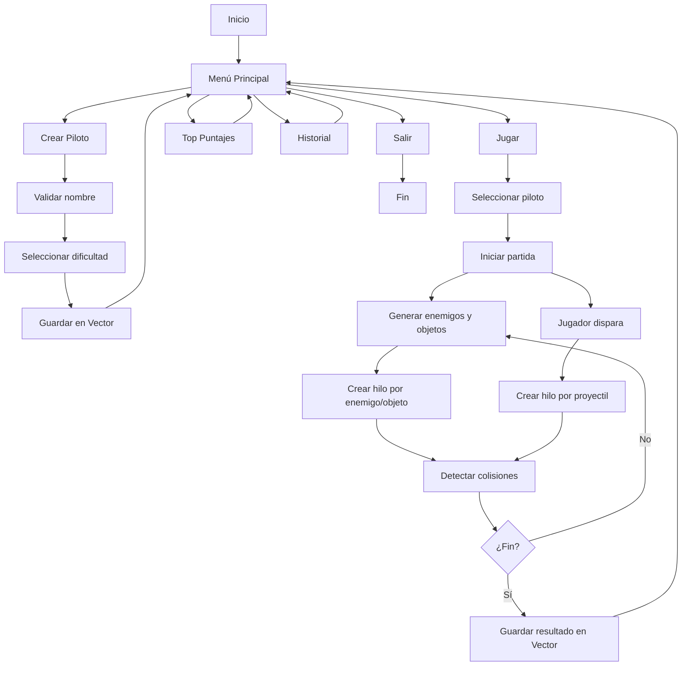

# Diagrama de Flujo

```mermaid
flowchart TD
    A[Inicio] --> B[Menú Principal]
    B --> C[Crear Piloto]
    B --> D[Jugar]
    B --> E[Top Puntajes]
    B --> F[Historial]
    B --> G[Salir]

    C --> C1[Validar nombre]
    C1 --> C2[Seleccionar dificultad]
    C2 --> C3[Guardar en Vector]
    C3 --> B

    D --> D1[Seleccionar piloto]
    D1 --> D2[Iniciar partida]
    D2 --> D3[Generar enemigos y objetos]
    D3 --> D4[Crear hilo por enemigo/objeto]
    D2 --> D5[Jugador dispara]
    D5 --> D6[Crear hilo por proyectil]
    D4 --> D7[Detectar colisiones]
    D6 --> D7
    D7 --> D8{¿Fin?}
    D8 -- No --> D3
    D8 -- Sí --> D9[Guardar resultado en Vector]
    D9 --> B

    E --> B
    F --> B
    G --> H[Fin]
```
